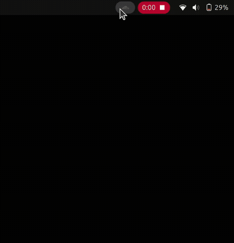

# Cloudflare WARP Applet

The missing Applet for Cloudflare WARP on Linux for easy connect or disconnect WARP by mouse-clicking on the panel. Sometimes, we want to take a break from typing on the terminal, don't we?

This acts as a frontend for [warp-cli](https://developers.cloudflare.com/warp-client/get-started/linux/).



## Prerequisites

1. Install Cloudflare's [warp-cli](https://developers.cloudflare.com/warp-client/get-started/linux/)

## Install

If you have [Go](https://go.dev/) installed and want to build from source:

```sh
go install github.com/muktihari/warp-applet@latest
```

Or, you can just download the **warp-applet** binary from [Release Assets](https://github.com/muktihari/warp-applet/releases), don't forget to make it executable:

```sh
chmod +x warp-applet
```

## Run

```sh
warp-applet
```

## Create Launcher

Create launcher so you can open it via Applications Launcher (e.g. Show Apps on GNOME).

```sh
warp-applet -create-launcher
```

## Autostart on Login:

Enable auto start so the applet is ready right after you login.

```sh
warp-applet -autostart
```

## Troubleshooting

If this applet is unexpectedly crashed (e.g. force killed) and is in broken state (e.g. can't run the applet due to dangling lock file), please run this following command, this will completely remove all files created by the applet such as launcher, autostart and lock file (you'll need to recreate the launcher and the autostart file again):

```sh
warp-applet -cleanup
```
